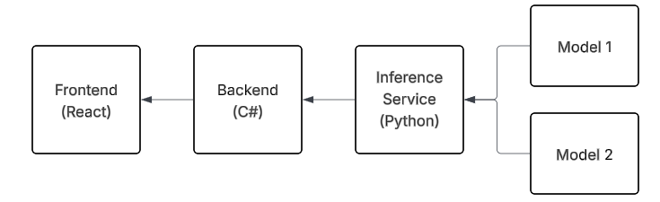

# Simple Webservice

I like playing around with the models from HuggingFace. I eventually want to make a fully interactive "agent" using some of the models avaiable, but to do that I wanted to first make a simpler system which I could eventually expand. 

This is the simple service. It has a frontend, a backend and an Inferance service. The architecture is made such that I can run the frontend on any machine and have the backend and inference run on my PC. Commuincation is done vias REST api's. The idea behind seperating the backend from inferance is that the services of the backend should not depend on the models I choose to run, so the inference modules exist to have the unique code for each model such that I can easily plug it in into the backend. 
